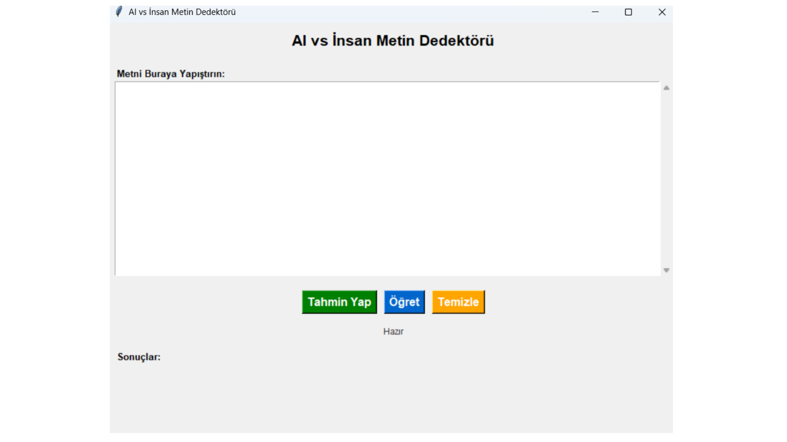
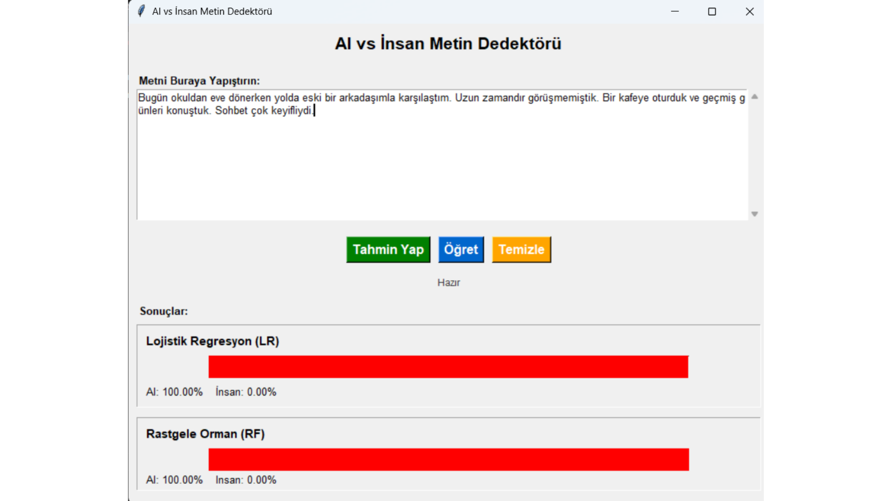

# UI/UX Tasarım Raporu

## 1. Amaç
Kullanıcıların Türkçe metin girerek hızlı şekilde AI/Human tahmin sonucu alabileceği sade ve anlaşılır bir arayüz tasarlanmıştır.  
Arayüzde kullanıcı dostu bir akış izlenmiş ve çıktıların yüzdelik oranlarla anlaşılır şekilde sunulması hedeflenmiştir.

---

## 2. Kullanılan Teknoloji
- Python GUI (gui.py)
- Tek sayfalık sade tasarım
- Kullanıcı etkileşimi odaklı butonlar (Tahmin Yap / Öğret / Temizle)

---

## 3. Kullanıcı Akışı (User Flow)
1. Kullanıcı metni giriş alanına yapıştırır  
2. **Tahmin Yap** butonuna basar  
3. Sistem 3 model üzerinden tahmin yapar (LR, RF, SVM)  
4. Sonuçlar kullanıcıya **AI / İnsan yüzdesi olarak** gösterilir  
5. İsteğe bağlı olarak kullanıcı **Öğret** butonu ile sisteme yeni veri ekleyip modeli yeniden eğitebilir  
6. Kullanıcı **Temizle** ile formu sıfırlayabilir

---

## 4. Arayüz Bileşenleri
1. **Metin giriş alanı (Text Area)**  
   - Kullanıcının metni kolayca kopyala-yapıştır yapabileceği büyük bir alan

2. **Tahmin Yap butonu**  
   - 3 farklı ML modeli ile tahmin üretilir

3. **Öğret butonu**  
   - Kullanıcı metin ekleyerek sistemi yeniden eğitebilir

4. **Temizle butonu**  
   - Metin alanı ve çıktı alanlarını temizler

5. **Sonuç alanı**  
   - 3 modelin tahmini ayrı ayrı gösterilir  
   - Yüzdelik oranlar ile AI / Human olasılığı sunulur

---

## 5. Kullanılabilirlik (Usability)
- **Tek tıklama ile tahmin yapılabilmesi**  
- Sonuçların anlaşılır şekilde **yüzde oranı ile** sunulması  
- Kullanıcı yanlış bir giriş yaptığında (boş metin / kısa metin) **uyarı mesajı** gösterilmesi  
- Arayüz sade tutulmuş, kullanıcıyı yormayan minimal tasarım uygulanmıştır

---

## 6. Hata Yönetimi ve Kullanıcı Bildirimi
- Kullanıcı boş metin girerse: “Metin boş olamaz” uyarısı
- Metin çok kısa olursa: “Metin çok kısa” uyarısı
- Model dosyaları yüklenemezse: “Model bulunamadı, eğitim yapın” uyarısı

Bu sayede kullanıcı hataları kolay anlaşılır ve yönlendirici şekilde yönetilir.

---

## 7. Kullanıcı Deneyimi Değerlendirmesi (Mini Test)
Uygulama ekip içinde test edilmiştir:
- Kullanıcılar metin giriş alanını rahat bulmuş ve sonuçları kolay anlaşılır bulmuştur.
- “Tahmin Yap” butonu sayesinde tek tıklama ile tahmin alabilmek hızlı bir deneyim sağlamıştır.

---

## 8. Görseller
Aşağıdaki görseller uygulamanın arayüzünü göstermektedir:

- **Şekil-1:** Metin giriş ekranı  
- **Şekil-2:** Tahmin sonuç ekranı  

## Görseller

### Şekil-1: Uygulama Ana Ekranı

### Şekil-2: Tahmin Sonuçlarının Gösterimi

