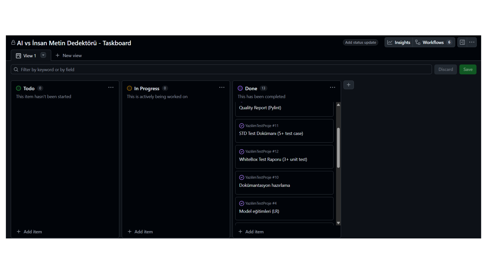
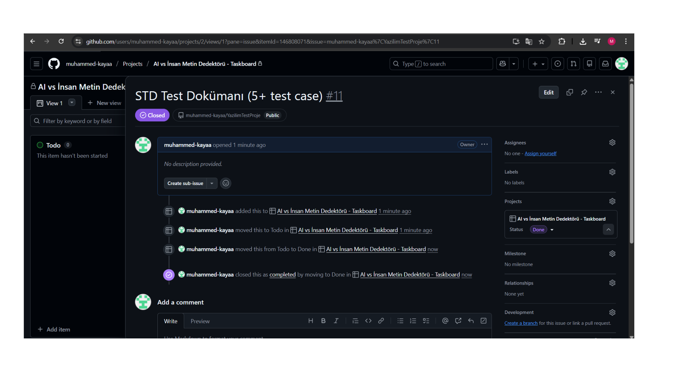

# Taskboard Kanıtı

## 1. Amaç
Bu doküman, proje geliştirme sürecinin görev bazlı olarak takip edildiğini göstermek amacıyla hazırlanmıştır.  
Proje boyunca görevler sprintlere ayrılmış ve ekip üyeleri tarafından taskboard üzerinden yönetilmiştir.

---

## 2. Kullanılan Araç
- GitHub Projects / Trello / Monday (ekip tarafından kullanılan platform)

---

## 3. Taskboard Linki
- **Taskboard URL:** (Buraya taskboard linkini yapıştırın)

> Not: Eğer link özel ise ekran görüntüsü kanıt olarak eklenmiştir.

---

## 4. Sprint / Görev Planı

### Sprint-1: Veri Toplama ve Hazırlama
- Veri seti toplama (arxiv + LLM)
- Ham verileri CSV formatına dönüştürme
- İlk veri kontrolü (boş satır, encoding)

### Sprint-2: Veri Temizleme ve Ön İşleme
- Metin temizleme (boş satır temizleme, normalize işlemleri)
- Çok kısa metin filtreleme
- İşlenmiş dataset oluşturma (`dataset.csv`)

### Sprint-3: Model Eğitimi ve Değerlendirme
- ML modellerinin eğitimi (LR, RF, SVM)
- TF-IDF feature extraction
- Accuracy, Precision, Recall, F1 ölçümleri
- Model dosyalarının kaydedilmesi (`.pkl`)

### Sprint-4: Uygulama ve Teslim Hazırlığı
- GUI geliştirme (`gui.py`)
- CLI entegrasyonu (`src/predict.py`)
- Test dokümanları hazırlanması (STD + WhiteBox)
- Kod kalite raporu oluşturma (Pylint)

---

## 5. Görseller (Kanıt)
Aşağıdaki görseller taskboard üzerinde görevlerin tanımlandığını ve tamamlandığını göstermektedir:

### Şekil-1: Taskboard Genel Görünümü

### Şekil-2: Sprint ve Görev Detayları

> Not: Görseller `Dokümantasyon/` klasöründe yer almaktadır.
